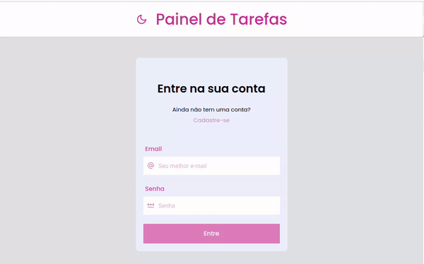
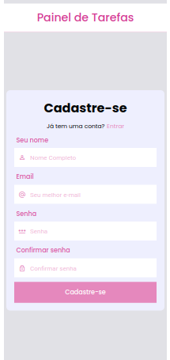

# Painel de Tarefas

- [Painel de Tarefas](#painel-de-tarefas)
  - [Apresentação](#apresentação)
  - [Primeiros passos](#primeiros-passos)
  - [Backend: APIRest](#backend-apirest)
  - [Variáveis de ambiente](#variáveis-de-ambiente)
  - [Cores e fontes](#cores-e-fontes)
  - [Temas](#temas)
  - [Teste (em desenvolvimento)](#teste-em-desenvolvimento)
  - [Páginas](#páginas)
    - [SignUp](#signup)
    - [SignIn](#signin)
    - [Home](#home)
  - [Componentes](#componentes)
    - [Button](#button)
    - [ButtonText](#buttontext)
    - [Header](#header)
    - [Input](#input)
    - [Task](#task)


## Apresentação

Fronted para aplicação WEB para registrar Tarefas com classificação de prioridade

- Desenvolvido em ReactJS v18.2.0;
- Ambiente de desenvolvimento construído com Vite v4.4.5;
- Préprocessador de CSS StyledComponents v6.0.8;
- Requisições HTTP com Axios v1.5.1;
- Gerenciamento de estados global Redux v4.2.1;
- Teste com Jest v29.7.0 e React-Testing-Library v14.1.0;

## Primeiros passos

- [Diretorio do Gihub](https://github.com/pedromsra/CoderTroop_FE);
- Seguir os passos do link [Clonar um repositório](https://docs.github.com/pt/repositories/creating-and-managing-repositories/cloning-a-repository) para realizar o **git clone** da aplicação;
- Para os fins desse projeto será considerado a [porta](http://localhost:3009);
- Criar, no root, um arquivo .env com o mesmo conteúdo do arquivo sample.env;
  - VITE_API_URL=https://codertroop-api.onrender.com
  - VITE_API_URL_LOCAL=https://codertroop-api.onrender.com
- Abrir o terminal e digitar:
  - `$ cd /local_da_pasta_onde_a_aplicação_foi_salva`
  - `$ npm install`
  - `$ npm run dev`

## Backend: APIRest

- O app funciona integrado à um [backend APIRest](https://github.com/pedromsra/CoderTroop_API):
  - A API está rodando no endereço: [API](https://codertroop-api.onrender.com) hospedada na nuvem;
  - Para alterar a porta ou endereço do Backend, ver [Variáveis de ambiente](#variáveis-de-ambiente);

## Variáveis de ambiente

- Conforme arquivo sample.env as variáveis de ambiente utilizadas são:
  - VITE_API_URL, que indica o endereço da API utilizada no ambiente de produção;
  - VITE_API_URL_LOCAL, que indica o endereço da API utilizada no ambiente de desenvolvimento;
  - Para utilizar o ambiente de desenvolvimento e a API localmente é necessaio acessar o arquivo /src/.env e mudar o valor da chave VITE_API_URL para o endereço e porta local; ex:
    - VITE_API_URL=http://localhost:3003;

## Cores e fontes

- As cores e fontes utilizadas na aplicação estão definidas no arquivo /src/styles/theme.ts, é fortemente recomendado que alterações de cores e fontes seja realizadas diretamente no arquivo theme.ts;

## Temas

- Utilizou-se Redux em conjunto do Styled Components ThemeProvider para implementar uma versão escura (Darkmode)
- Dessa maneira há lightTheme{} com cores para a versão clara e darkTheme{} com as cores para a versão escura no arquivo /src/styles/theme.ts
- Segue .gif do funcionamento:



## Teste (em desenvolvimento)

- Testes com Jest e React-Testing-Library;
- Escopo: Até o momento foi implementado testes para o Componente Task, responsável por renderizar uma tarefa na Página Home.
  - Foi implementado teste, verificando a ocorrência das consequências esperadas, para:
    - 'clique' no botão de editar tarefa; e
    - 'clique' no ícone de concluir a tarefa;
- Para executar os teste: `npm run test`

## Páginas

Segue a imagens das páginas utilizadas nessa aplicação.

> Os componentes podem ser identificados nas imagens.

### SignUp




### SignIn


### Home


## Componentes

> A documentação dos componentes irá cubrir a utilização dos componentes, qualquer personalização deverá ser realizada no arquivo "/src/components/'componente'/styles.js" para cores, tipos e dimensões personalizadas. 

> No geral, os componentes recebem props como onClick = {...}, etc. 

### Button

- Descrição: Botão simples em caixa;
- Aplicação:

```html
    <Button title="Meu botão" icon={{icon: <span className="material-symbols-outlined">exemple</span>}} loading outlined />
```

- Comentário:
  - O título precisa ser informado, para aparecer em branco informar como "";
  - Em caso de ```loading = "true"``` irá aparecer, no lugar do título, a palavra "loading...";

### ButtonText

- Descrição: Texto clicável, com função de ```type = button```;
- Aplicação:

```html
    <ButtonText title="Meu botão" icon={{icon: <span className="material-symbols-outlined">exemple</span>}} />
```

- Comentário:
  - O título precisa ser informado, para aparecer em branco informar como "";

### Header

- Descrição: Navbar com imagem do usuário e botão para logout;
- Aplicação:

```html
    <Header handleFilter={handleFilter} />
```

- Comentário: handleFilter é aplicado na página Home, no modo mobile, para selecionar os filtros e aplicar às tarefas exibidas;

### Input

- Descrição: input html usado para type = text, permite adicionar icone;
- Aplicação:

```html
    <Input icon = {myIcon} placeholder="My input" type = "text" icon={{icon: <span className="material-symbols-outlined">exemple</span>}} />
```

- Comentários: é essencialmente um ```<input />```, pode-se usar value, onChange, etc...;

### Task

- Descrição: renderiza uma tarefa a ser exibida na página Home;
- Aplicação:

```html
    <Task key={String(note.id)} task={task} 
    handleUpdateTasks={handleUpdateTasks} handleDeleteTasks={handleDeleteTasks} />
```

- Comentários:
  - Task está implementado de forma a ser exibido na página Home;
  - task é um objeto, que contém chave:tipo {task:string, priority:number, done:boolean};
  - task é a tarefa propriamente dita, priority é a prioridade da tarefa e done é o estado de conclusão da tarefa;